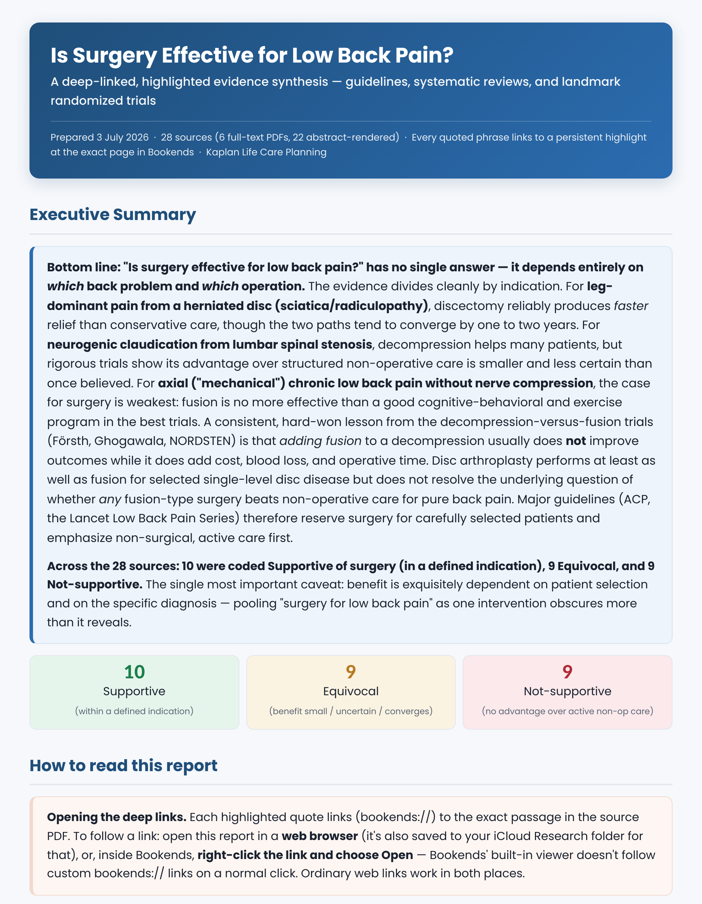
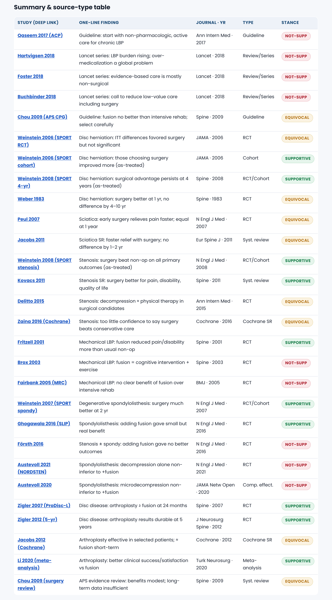
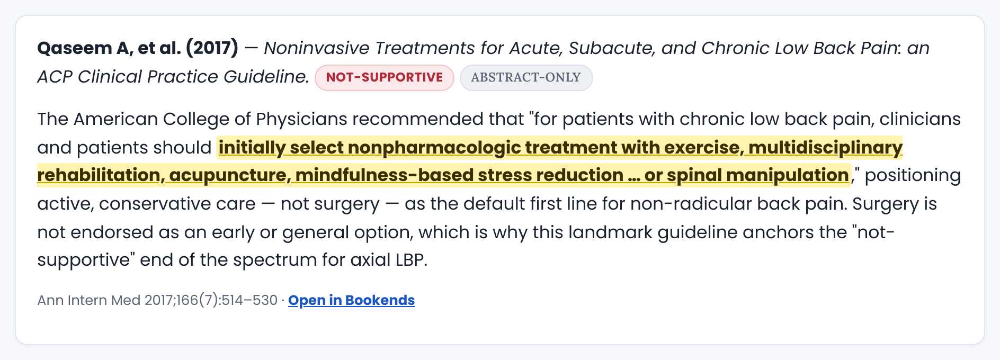
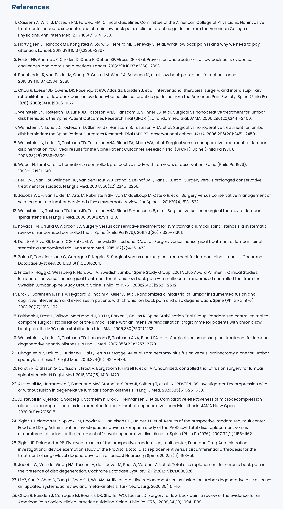
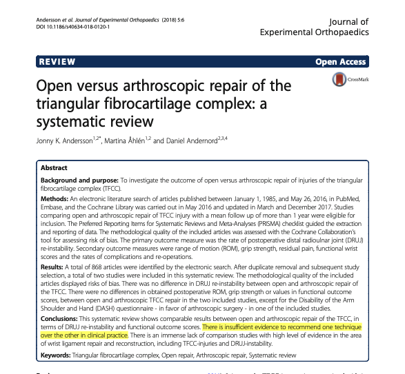

# Bookends Research Skill

A Claude skill that turns a research question into a **deep-linked, highlighted evidence
report** built on top of your [Bookends](https://www.sonnysoftware.com/bookends-for-mac)
library.

You give it a topic. It finds the literature, files it into Bookends, attaches the PDFs,
**writes a persistent highlight over the key passage in each source PDF**, and produces a
single HTML report in which **every quotation is a link that opens that source PDF in
Bookends, scrolled to the highlighted sentence.**

You land on the evidence itself, not on a bibliography entry. And the highlights are
written into the PDFs in your library — they are still there next time you open the
article, report or no report.

macOS only. Requires Bookends, a paid Mac app. See [Requirements](#requirements).

## What a run produces

One combined, styled HTML report, saved into Bookends (as a linked PDF) and to a folder on
disk (as HTML):

**An executive summary with a stance tally** — the bottom line up front, plus how many
sources supported, were equivocal on, or did not support the proposition.



**A summary / source-type table** — one row per study: a one-line finding, the journal, the
source type (guideline, RCT, systematic review, cohort…), and a colored stance pill. Each
study name is a deep link.



**Per-article cards with the quotes woven in** — each card embeds one to three exact
verbatim quotes from that article. Each quote is highlighted in the source PDF and is a live
`bookends://` link to that exact page.



**A Vancouver-style reference list**, numbered in citation order. Every entry carries a web
link (DOI → PubMed → publisher URL) plus links back into Bookends.



**And this is where a quote link actually lands** — the source article itself, open in
Bookends at the right page, with the skill's persistent yellow highlight sitting on the
quoted sentence:



The report also contains a navigable narrative synthesis (an argued, multi-section review
with an internal table of contents) and a plain-text "Academic Summary" section you can
paste straight into Word.

## Requirements

This is a **macOS + Bookends** tool. It is not portable to Windows, Linux, Zotero, or
Mendeley, and it is not a general-purpose literature search — the deep links are Bookends'
`bookends://` URL scheme.

**Bookends 15.4.2 or later** — a paid Mac app from Sonny Software (~$60; free demo capped
at 50 references). Version 15.4.2 is what introduced the built-in **Bookends MCP server**,
which is how the skill drives Bookends. There is nothing separate to install: open Bookends
→ **Settings → Servers → MCP Server** and let it configure your AI assistant (it can
auto-configure Claude Desktop, Codex, Cursor, and LM Studio). If you are on an older
Bookends, upgrade first — the skill will not work without the MCP server.

**Python 3** with:

```
pip install pymupdf                    # locates the quote, writes the highlight, resolves the page
pip install pyobjc-framework-Quartz    # lets the validator detect a Bookends error dialog
pip install pypdf                      # audits the link annotations in the rendered report PDF
```

**Google Chrome** — used headlessly (`--headless=new --print-to-pdf`) to render the finished
HTML report into a PDF that keeps its hyperlinks clickable, including the custom-scheme
`bookends://` ones. No browser window opens; nothing is automated on screen.

**A literature-search tool for your AI assistant** — the skill routinely searches for
candidate papers and verifies their PMIDs/DOIs before handing them to Bookends to retrieve.
It expects either a [Firecrawl](https://firecrawl.dev) MCP server (its research/paper-search
tools) or a PubMed MCP server to be connected. Bookends retrieves the PDFs; the search tool
finds the papers. Without one of these connected, source discovery will be thin.

## Install

Clone this repo and install it as a Claude plugin — it is self-contained
(`.claude-plugin/plugin.json`, `SKILL.md`, `references/`, `scripts/`):

```
git clone https://github.com/richardkaplan/bookends-research-skill.git
```

Then point your Claude plugin install at that folder and restart Claude Desktop. The skill
appears as **bookends-research-skill**.

## Usage

Ask for it in one line. The topic is the only thing you supply:

```
Run the Bookends Research Skill on <your question>
Bookends deep-link report on <your question>
Deep-linked literature review in Bookends on <your question>
```

The skill then, without further prompting:

1. Creates a new Bookends group named for the topic, with subtopic child groups derived from
   how the literature on that topic is actually organized, plus a `Reports` folder.
2. Searches for authoritative sources — guidelines, systematic reviews and meta-analyses,
   landmark primary studies — and verifies each one's DOI/PMID.
3. Has Bookends retrieve each reference and download and attach its full-text PDF. Where no
   full text is reachable, it attaches a rendered abstract page and flags the source as
   abstract-only.
4. Locates the key passage in each PDF, writes a persistent highlight over it, and reads the
   page-accurate `bookends://` deep link back out of Bookends.
5. Files each reference into its subtopic folder and classifies its stance.
6. Writes the report, renders it to a link-preserving PDF, files that PDF in the `Reports`
   folder, and saves the HTML copy to disk.
7. Validates every link before it ships — a report whose deep links do not resolve is treated
   as a failed run, not a delivered one.

### Where the output goes

- **Into Bookends** — the report PDF is attached to its own reference in the `<Topic> — Reports`
  subgroup, with the deep-link list in that record's Notes.
- **To disk** — the HTML copy is written to `RESEARCH_DIR`, set near the top of `SKILL.md`.
  It defaults to your iCloud Drive (`$HOME/Library/Mobile Documents/com~apple~CloudDocs/Research`),
  falling back to `$HOME/Research`. Change it to anywhere you like; nothing is hardcoded to a
  particular user.

### Following the deep links

`bookends://` links work inside Bookends and from a web browser (the browser hands the scheme
to macOS, which routes it to Bookends). For a link to be clickable *inside* a Bookends field,
it has to be styled text with a live hyperlink — paste with a normal **⌘V**, not "Paste and
Match Style," which strips the link to dead plain text.

## What it is good for

Any question with a literature behind it — the topic is the only variable. Clinical evidence
syntheses and treatment-efficacy reviews, drug and therapy comparisons, prognosis and
natural-history questions, diagnostic work-ups, adverse-event profiles, standard-of-care
questions. It is not limited to medicine: any scholarly field with a published literature
works the same way, and the annotated-bibliography use case — where every quote must link to
the exact passage in its source — is exactly what the output format is built for.

## Optional: reporting on a DEVONthink group

If you also use DEVONthink and have a DEVONthink MCP server connected, you can point the
skill at a DEVONthink group instead of typing a question. It reads the group's documents,
works out the pertinent topics itself, runs the same pipeline, saves the HTML report back
into that group, and cross-links the two: the report carries a link to the source DEVONthink
group and a link to the matching Bookends folder, in both copies.

This path depends on a DEVONthink MCP server, which is not part of this repo. If you do not
have one, ignore this section — the skill's main path does not need DEVONthink.

## Privacy

Bookends and DEVONthink are local, on-disk apps, and the report copies stored in them stay on
your machine. The disk copy of the report defaults to iCloud Drive — if you are working with
confidential material, point `RESEARCH_DIR` somewhere local instead.

## Files

```
bookends-research-skill/
├── SKILL.md                     # the pipeline (topic = the only variable)
├── README.md
├── .claude-plugin/plugin.json   # plugin manifest
├── references/bookends.md       # Bookends calls, bookends:// link forms, Vancouver, bridge quirks
├── scripts/
│   ├── highlight_and_link.py         # PyMuPDF: find the quote, write the highlight, resolve the page
│   ├── validate_bookends_links.py    # pre-ship gate: every bookends:// link must resolve
│   ├── validate_bookends_attachment.py
│   └── styled_links_to_clipboard.sh
└── examples/screenshots/        # the images above
```

## License

MIT — see [LICENSE](LICENSE).

## Author

**Richard S. Kaplan, MD** — Kaplan Life Care Planning

- Email: rkaplan@kaplanlifecareplan.com
- Website: https://kaplanlifecareplan.com/

Questions and suggestions welcome.
